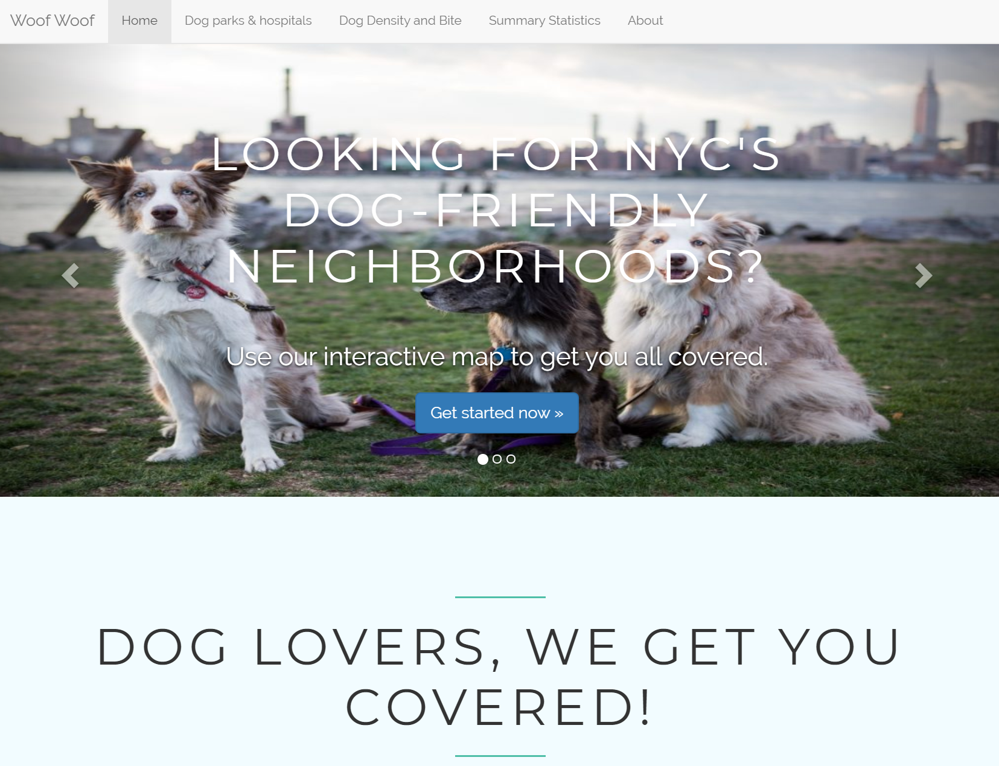
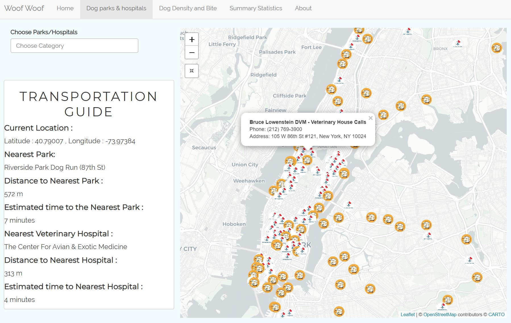
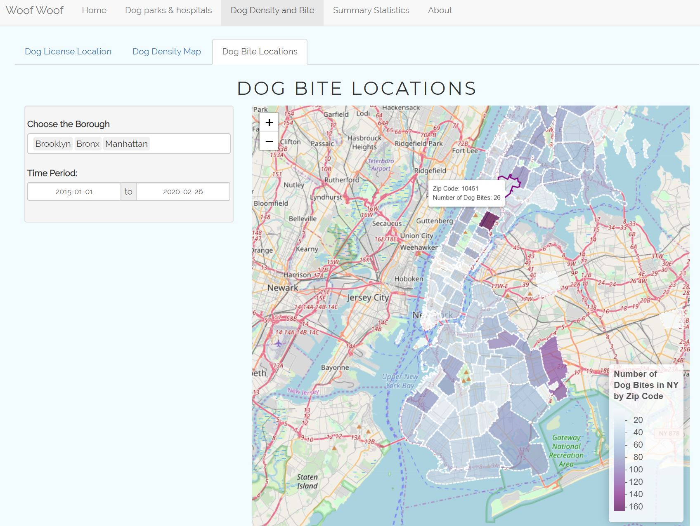
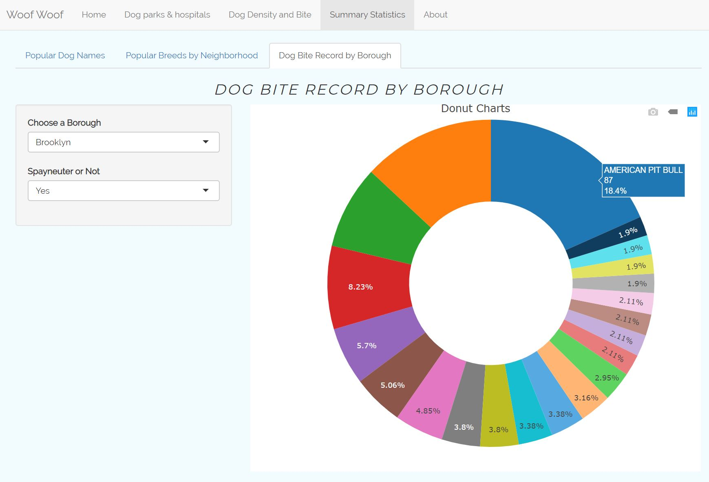

# babe_doggy_html# Project 2: Shiny App Development, for dog owners in NYC







## Woof Woof: We Get Your Dogs Covered
Term: Spring 2020

+ Team # 1

+ Shiny Link : https://loving-dogs.shinyapps.io/Group1_Project2/

+ **Team Members**: 
    + Feng, Kangli (Team Leader) [kf2616@columbia.edu](kf2616@columbia.edu)
	+ Du, Jinxiao [jd3607@columbia.edu](jd3607@columbia.edu)
	+ Zhu, Huizhe [hz2657@columbia.edu](hz2657@columbia.edu)
	+ Lyu, Wenfeng [wl2733@columbia.edu](wl2733@columbia.edu)
	+ Chen, Shenhan (Presenter) [sc4615@columbia.edu](sc4615@columbia.edu)

+ **Project summary**: 

In a city of cramped living quarters, fifth-floor walk-ups and limited access to outdoor space, you may think pets would be a tough sell for New York City residents. Yet roughly 425,000 dogs live in New York City – more dogs than there are people in Oakland, CA.

To develop this project, we referenced the data on NYC Open Data, as well as other open data sources such as Google, Github and Kaggle, to uncover the most popular dog breeds and names in NYC neighborhoods, and the best neighborhoods in New York City for dogs and their faithful owners. Moreover, we included the statistical analysis of the most dog bites occurence in NYC neighborhoods for those people who want to live in the neighborhoods with fewer dogs. Our project goal is to help you get extensive dog-related information around NYC's neighborhoods.

+ **User guide**: 
    + Click the "Dog parks & hospitals" tab, you can find the nearest dog parks to walk your dogs, with the walking distance and estimated transportation time available. Don't panic when your dog get sick, use our map to find the nearest dog hospitals.
    + Click the "Dog Density Map" tab, in the 'Dog license map', you can find the dog license information distributed by area. In 'Dog Density Map', you can find the most dog friendly neighborhoods as well as the specific number of dogs in those areas. Click the 'Dog Bite Map', you can view information about the dog bites accidents by neighborhoods and check by time.
    + Click the "Summary Statistics" tab, you can view the statistical results about NYC dogs' names and breeds. There are settings available for you to customize the plots. Scroll down and try them out!
    + Other related news and articles can be found in the remaining tabs. Enjoy the journey with us.


+ **Contribution statement**:
    + **Kangli Feng (Team Leader)**: Designed the template for the Shiny App page including html files for `Home` and `About` page. Cleaned, tidied and visualized data of veterinary hospitals and dog runs area. Calculated and displayed estimated distance and time taken to the nearest hospital and park from any given location. Integrated and tidied other teammates’ work. 
    + **Du, Jinxiao**: Finished the cluster points map of Dog Licenses and heatmap of Dog Licenses both by myself. Processed the data of Dog Licenses and design the format of Map page. Besides, help other members debug.
    + **Lyu, Wenfeng**: Data cleaning, design the statistics tab and the content format, including the popular nyc dog names by year bar chart, as well as the popular dog breed plotly bar chart. Write up the introduction & R markdown text files, and gathering interesting dog logo!
    + **Zhu, Huizhe**: Created heat map visualization; Monitored project flow and meeting agenda; Quality control, structuring and restructuring app's organization, text polishing; Data collection and Cleaning.
    + **Chen, Shenhan (Presenter)**: Data collecting and cleaning for dog bite records, created and generated statistical data summary, designing homepage; Presented project results to over 70 audience.

+ **Data Sets Used**:

We used data from NYC Open Data, as well as other open data sources from Google, Github, and Kaggle. Here are some of data sets we used:
+ [Dog licences (Kaggle)](https://www.kaggle.com/puppygogo/nyc-active-dog-licenses)
+ [Dog bite data (NYC open data)](https://data.cityofnewyork.us/Health/DOHMH-Dog-Bite-Data/rsgh-akpg/data)
+ [Directory of Dog Runs and Off-Leash Areas(NYC open data)](https://data.cityofnewyork.us/Recreation/Directory-of-Dog-Runs-and-Off-Leash-Areas/ipbu-mtcs)
+ [NYC Dog Names(Kaggle)](https://www.kaggle.com/new-york-city/nyc-dog-names)
+ [Dog parks in NYC(Kaggle)](https://www.kaggle.com/new-york-city/dog-parks-of-nyc)

Following [suggestions](http://nicercode.github.io/blog/2013-04-05-projects/) by [RICH FITZJOHN](http://nicercode.github.io/about/#Team) (@richfitz). This folder is orgarnized as follows.

```
proj/
├── app/
├── lib/
├── data/
├── doc/
├── output/
├── rsconnect/
└── www/
```

Please see each subfolder for a README file.

